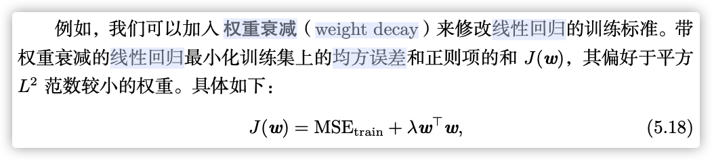

# Basics

### ML概念

机器学习：对于某类任务T和性能度量P，一个计算机程序被认为可以从经验E中学习是指，通过经验E改进后，他在任务T上由性能度量P衡量的性能有所提升。

### 过/欠拟合



1. 降低训练误差。
2. 缩小训练误差和测试误差的差距。




* 欠拟合：模型不能在训练集上获得足够低的误差。
* 过拟合：训练误差和测试误差之间的差距太大。




### 正则化

正则化（Regularization）：修改学习算法，使其降低泛化误差而非训练误差。增加正则化项（Regularizer）从而表示对假设空间中函数的偏好。

### 没有免费午餐定理

没有免费午餐定理（No Free Lunch Theorem）：在所有可能的数据分布上平均之后，每一个分类算法在未事先观测的点上都有相同的错误率。

> ML的目标不是找一个通用学算法或是绝对最好的学习算法，而是理解什么样的分布与人工智能获取经验的『真实世界』相关，以及什么样的学习算法在我们关注的数据生成分布上效果最好。

### 奥卡姆剃刀

奥卡姆剃刀（Occam's razor）：在同样能够解释已知观测现象的假设中，我们应该挑选『最简单』的哪一个。

